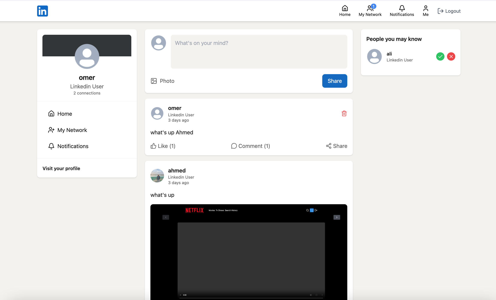
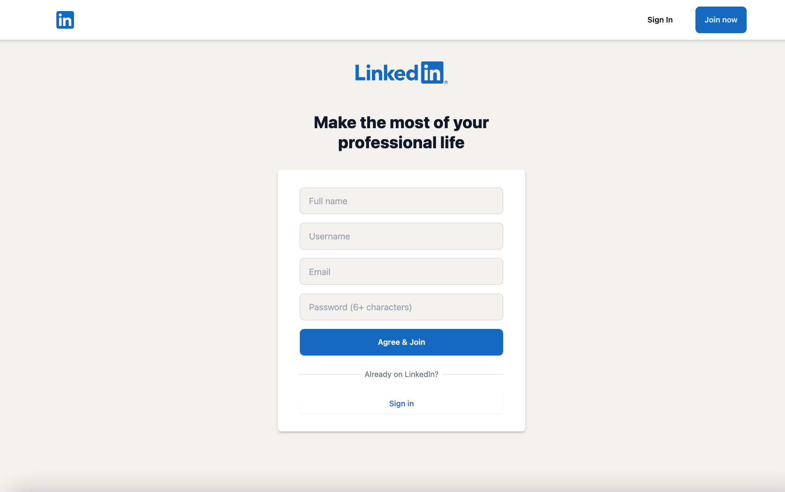
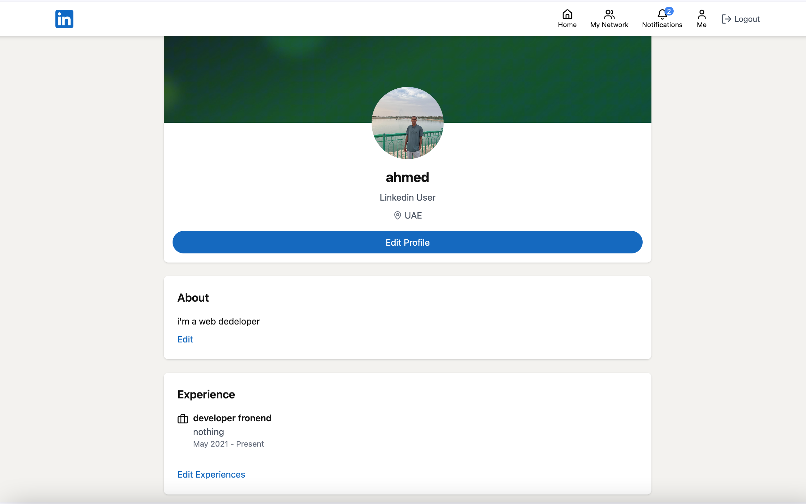
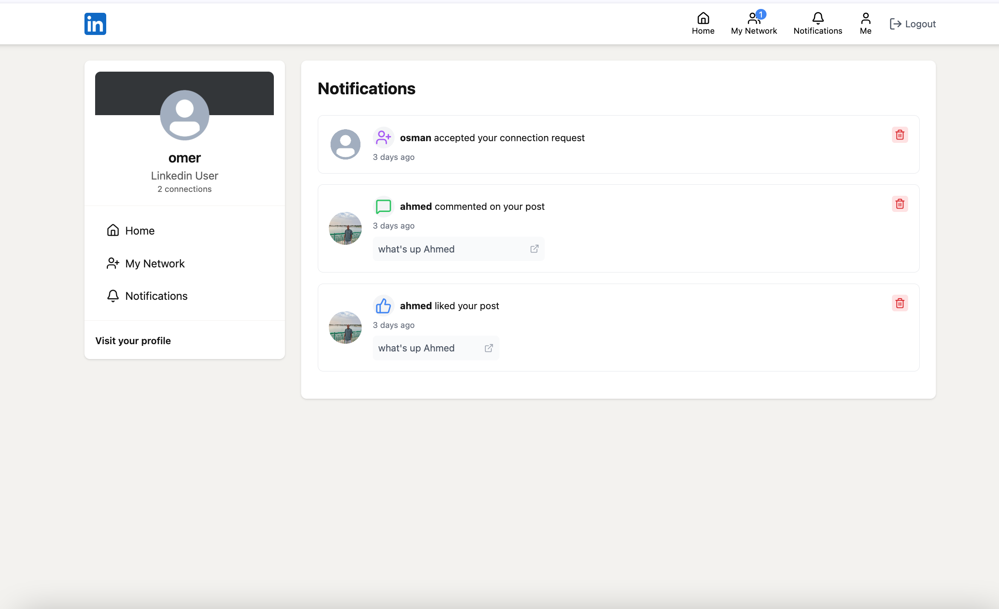
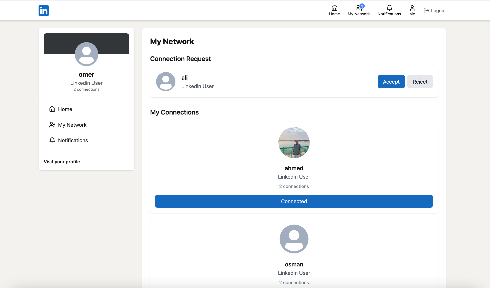

# LinkedIn Clone

A full-stack LinkedIn clone built with React and Node.js, featuring user authentication, social networking, posts, connections, and notifications.



## Features

- 🔐 **User Authentication** - Secure signup and login with JWT tokens
- 👤 **User Profiles** - Complete profiles with experience, education, skills, and custom images
- 📝 **Posts** - Create, like, and comment on posts with image support
- 🤝 **Connections** - Send and manage connection requests
- 🔔 **Notifications** - Real-time notifications for connections and interactions
- 🏠 **Home Feed** - View posts from your network
- 🌐 **Network Page** - Discover and connect with other users
- 📸 **Image Upload** - Profile pictures, banners, and post images using Cloudinary

## Tech Stack

### Frontend
- **React 19** - UI library
- **Vite** - Build tool and dev server
- **React Router DOM** - Routing
- **TanStack Query** - Data fetching and caching
- **Tailwind CSS** - Styling
- **DaisyUI** - Component library
- **React Hot Toast** - Notifications
- **Lucide React** - Icons
- **Axios** - HTTP client

### Backend
- **Node.js** - Runtime environment
- **Express.js** - Web framework
- **MongoDB** - Database
- **Mongoose** - ODM
- **JWT** - Authentication
- **Bcrypt** - Password hashing
- **Cloudinary** - Image storage
- **Mailtrap** - Email service

## Screenshots

### Registration Page


### Home Feed


### Profile Page


### Notifications


### Connection Requests


## Installation

### Prerequisites
- Node.js (v18 or higher)
- MongoDB (local or cloud instance)
- Cloudinary account (for image uploads)
- Mailtrap account (for email functionality)

### Setup

1. **Clone the repository**
   ```bash
   git clone <repository-url>
   cd Linkedin-clone
   ```

2. **Install backend dependencies**
   ```bash
   npm install
   ```

3. **Install frontend dependencies**
   ```bash
   cd frontend
   npm install
   cd ..
   ```

4. **Configure environment variables**

   Create a `.env` file in the `backend` directory:
   ```env
   PORT=5000
   MONGODB_URI=your_mongodb_connection_string
   JWT_SECRET=your_jwt_secret_key
   CLOUDINARY_CLOUD_NAME=your_cloudinary_cloud_name
   CLOUDINARY_API_KEY=your_cloudinary_api_key
   CLOUDINARY_API_SECRET=your_cloudinary_api_secret
   MAILTRAP_API_TOKEN=your_mailtrap_api_token
   ```

5. **Start the backend server**
   ```bash
   npm run dev
   ```
   The backend will run on `http://localhost:5000`

6. **Start the frontend development server**
   ```bash
   cd frontend
   npm run dev
   ```
   The frontend will run on `http://localhost:5173`

## Project Structure

```
Linkedin-clone/
├── backend/
│   ├── controllers/       # Request handlers
│   │   ├── auth.controller.js
│   │   ├── connection.controller.js
│   │   ├── notification.controller.js
│   │   ├── post.controller.js
│   │   └── user.controller.js
│   ├── emails/            # Email templates and handlers
│   ├── lib/               # Utilities (DB, Cloudinary, Mailtrap)
│   ├── middleware/        # Auth middleware
│   ├── models/            # MongoDB models
│   ├── routes/            # API routes
│   └── server.js          # Entry point
├── frontend/
│   ├── src/
│   │   ├── components/    # React components
│   │   ├── pages/         # Page components
│   │   ├── lib/           # Axios configuration
│   │   └── utils/         # Utility functions
│   └── public/            # Static assets
└── linkedin/              # Screenshots
```

## API Endpoints

### Authentication
- `POST /api/v1/auth/signup` - Register a new user
- `POST /api/v1/auth/login` - Login user
- `GET /api/v1/auth/me` - Get current user
- `POST /api/v1/auth/logout` - Logout user

### Users
- `GET /api/v1/users` - Get all users
- `GET /api/v1/users/:username` - Get user by username
- `PUT /api/v1/users/:id` - Update user profile

### Posts
- `GET /api/v1/posts` - Get all posts
- `POST /api/v1/posts` - Create a new post
- `GET /api/v1/posts/:postId` - Get post by ID
- `PUT /api/v1/posts/:postId/like` - Like/unlike a post
- `POST /api/v1/posts/:postId/comment` - Add comment to post

### Connections
- `GET /api/v1/connections/requests` - Get connection requests
- `POST /api/v1/connections/request/:userId` - Send connection request
- `PUT /api/v1/connections/request/:requestId` - Accept/reject request

### Notifications
- `GET /api/v1/notifications` - Get user notifications
- `PUT /api/v1/notifications/:id/read` - Mark notification as read

## Usage

1. **Sign Up**: Create a new account with your email, username, and password
2. **Complete Profile**: Add your experience, education, skills, and profile images
3. **Connect**: Browse the network page and send connection requests
4. **Post**: Share updates, images, and engage with your network
5. **Interact**: Like and comment on posts from your connections
6. **Stay Updated**: Check notifications for new connections and interactions

## Development

### Backend Scripts
- `npm run dev` - Start development server with nodemon
- `npm start` - Start production server

### Frontend Scripts
- `npm run dev` - Start Vite dev server
- `npm run build` - Build for production
- `npm run preview` - Preview production build
- `npm run lint` - Run ESLint

## Contributing

Contributions are welcome! Please feel free to submit a Pull Request.

## License

ISC

## Author

Built as a learning project to demonstrate full-stack development with React and Node.js.

